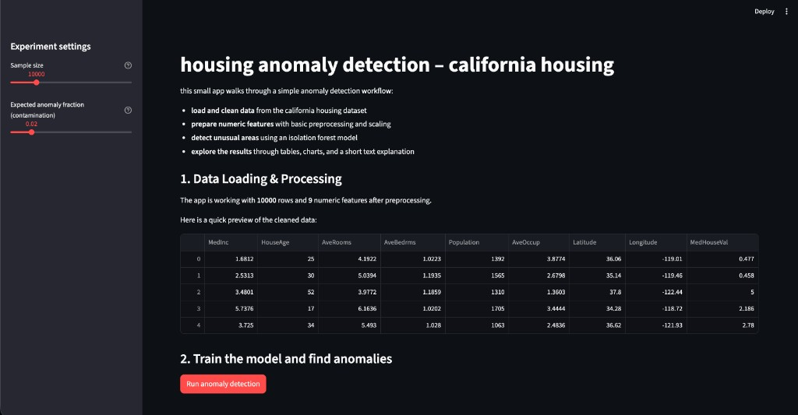

# Housing Anomaly Detection System

isolation forest + streamlit

## overview

this is a small and practical prototype to show a full anomaly detection workflow in python. it is kept simple on purpose so it is easy to read, talk about, and extend later.

## what this app does

- **dataset**: uses the `california housing` dataset from `scikit-learn`. each row represents a small area in california with housing and demographic information (for example median income, average rooms, population, latitude and longitude, and median house value).
- **goal**: find areas that look unusual compared to the rest (possible anomalies).
- **model**: isolation forest from `scikit-learn` (unsupervised anomaly detection).
- **interface**: streamlit app with a clear, step by step layout.

## main steps in the workflow

- **1. load and clean data**
  - load the california housing dataset with `sklearn.datasets.fetch_california_housing`.
  - sample a user chosen number of rows (always at least 5,000) so the app stays fast.
  - keep numeric columns and fill any missing values with the median of each column.

- **2. prepare features and train the model**
  - scale numeric columns with `standardscaler` so features are on a similar scale.
  - wrap scaling and the isolation forest model inside a single `sklearn` pipeline.
  - let the user choose the `contamination` value (their guess of what fraction of rows are anomalies).

- **3. detect anomalies**
  - fit the pipeline on the cleaned data.
  - compute an `anomaly_score` for each row (higher = more unusual).
  - add a binary flag `is_anomaly` where `1` means anomaly and `0` means normal.

- **4. visualise results**
  - show a table with only the anomalous rows, sorted by highest anomaly score.
  - plot a histogram of anomaly scores to see how many very unusual rows there are.
  - compare average numeric feature values between anomalies and normal rows in a bar chart (top 5 features that differ most).

- **5. short plain language explanation**
  - compare average values of numeric features between anomalies and normal rows.
  - pick the features where this difference is largest.
  - generate short sentences like “feature `population` tends to be higher for anomalous areas compared to normal ones.”

## tech stack

- **python** with `pandas`, `numpy`, `scikit-learn`
- **model**: `isolationforest` for unsupervised anomaly detection
- **ui**: `streamlit` for the simple web interface
- **plots**: `matplotlib` + `seaborn`

## project files and structure

- `data_pipeline.py`  
  loads and cleans the california housing dataset. this file is only about data, so it is easy to change the dataset or cleaning later.

- `model_pipeline.py`  
  builds the isolation forest pipeline, scores anomalies, and creates the short explanation text. this file is only about the machine learning logic.

- `app.py`  
  streamlit user interface: controls, data preview, running the model, visualisations, and explanation. this file does not know the details of cleaning or the model, it just calls the other two.

- `requirements.txt`  
  minimal list of python packages needed to run the app.

splitting the project like this (data / model / app) keeps each file small and focused. it also makes it easier to explain in a call: one file for data, one for the model, one for the interface.

## how to run it locally

1. optional but nice: create and activate a virtual environment  
   this is not mandatory, it just keeps this project’s python packages separate from the rest of your system.

   ```bash
   python -m venv .venv
   source .venv/bin/activate  # on windows use: .venv\scripts\activate
   ```

2. install dependencies

   ```bash
   pip install -r requirements.txt
   ```

3. start the streamlit app

   ```bash
   python3 -m streamlit run app.py
   ```

4. open the browser  
   streamlit will open a browser tab automatically (or show a local url). from there you can:
   - adjust sample size and contamination in the sidebar,
   - see a preview of the cleaned dataset,
   - click “run anomaly detection”,
   - explore anomalies, plots, and the text explanation.

## how you can explain this in a call

- **data**: “i used the california housing dataset from scikit‑learn. each row is a small area in california with information like median income, average number of rooms, population, and location. this makes the anomalies easy to think about: we are looking for areas that look very different from the rest.”
- **processing**: “i do simple but solid cleaning: i work with the numeric features, drop empty columns if there are any, and fill missing numeric values with the median.”
- **features and model**: “numeric features are scaled, and an isolation forest model is trained on top of that. isolation forest is a classic unsupervised anomaly detection method that works well on tabular data and does not need labels.”
- **visualisation**: “the app shows which rows are anomalous, how the anomaly scores are distributed, and which numeric features look most different between anomalies and normal areas.”
- **explanation**: “i added a tiny rule based explanation that compares average values between anomalies and normal rows and turns that into simple sentences, so it is easier to understand why some areas are flagged as unusual.”

## demo screenshot




